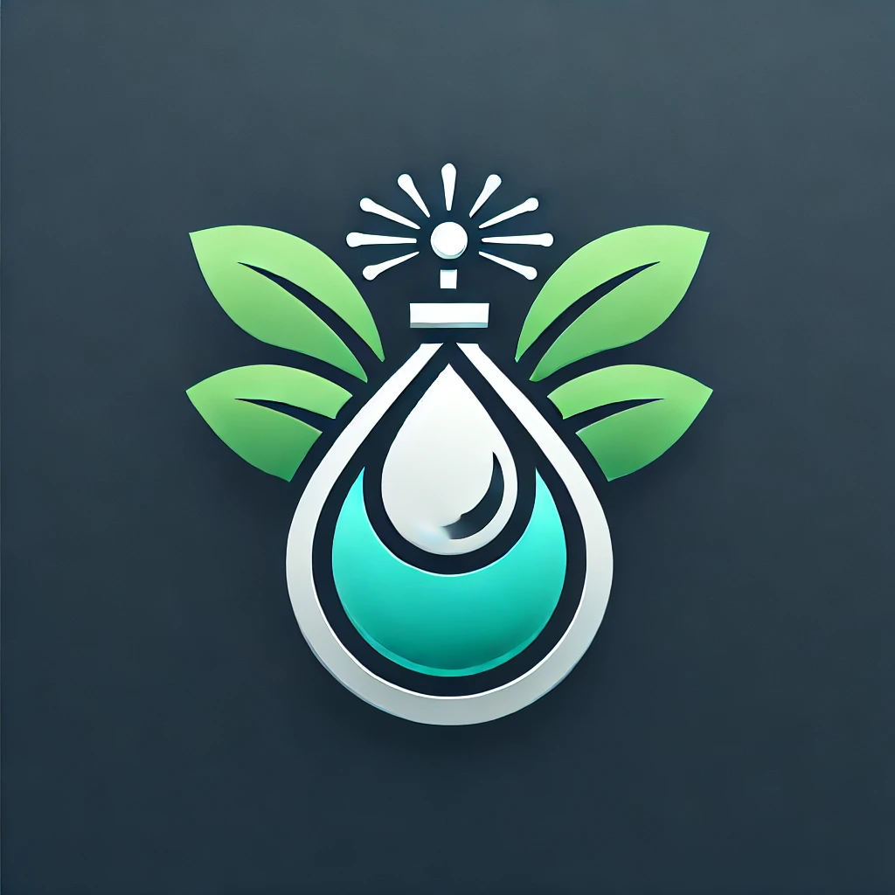

# PulveSys

PulveSys es una plataforma web para la gestión de órdenes de pulverización agrícola, administración de lotes, cultivos, tratamientos y usuarios. Incluye funcionalidades de historial, facturación y reportes PDF, con integración de mapas y suscripciones gestionadas por Mercado Pago.

## Características principales

- **Gestión de órdenes de pulverización**: Crea, edita y administra órdenes con detalles de productos, lotes y observaciones.
- **Administración de lotes y cultivos**: Utiliza mapas interactivos (MapBox) para marcar coordenadas y gestionar cultivos y tratamientos.
- **Historial de cambios**: Visualiza el historial de actividades y modificaciones recientes.
- **Reportes PDF**: Exporta órdenes y mapas en formato PDF para compartir.
- **Suscripciones**: Prueba gratuita de 30 días y gestión de pagos a través de Mercado Pago.
- **Planes Individual y Empresa**: El plan Empresa permite administrar usuarios y acceder a historial extendido.
- **Política de privacidad**: Protección de datos personales y opciones de contacto.

## Recursos útiles

- [Next.js Documentation](https://nextjs.org/docs)
- [Learn Next.js](https://nextjs.org/learn)
- [MapBox](https://www.mapbox.com/)
- [Mercado Pago](https://www.mercadopago.com.ar/)

## Contacto

Para soporte o consultas, escribí a bredicegian@gmail.com.

---

> Proyecto desarrollado por Gianluca Bredice y Matías Rodríguez.
